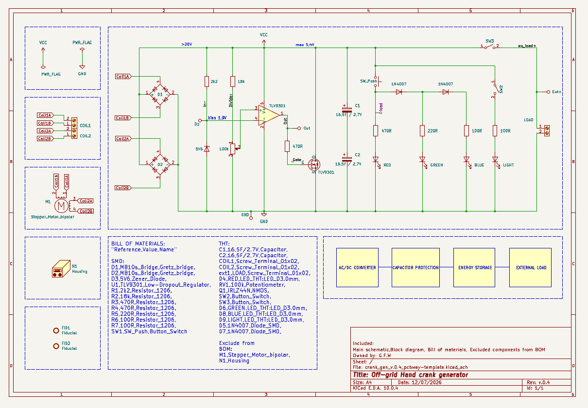
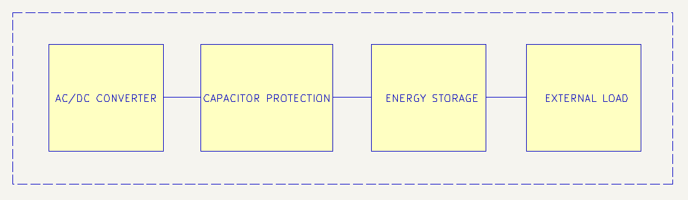
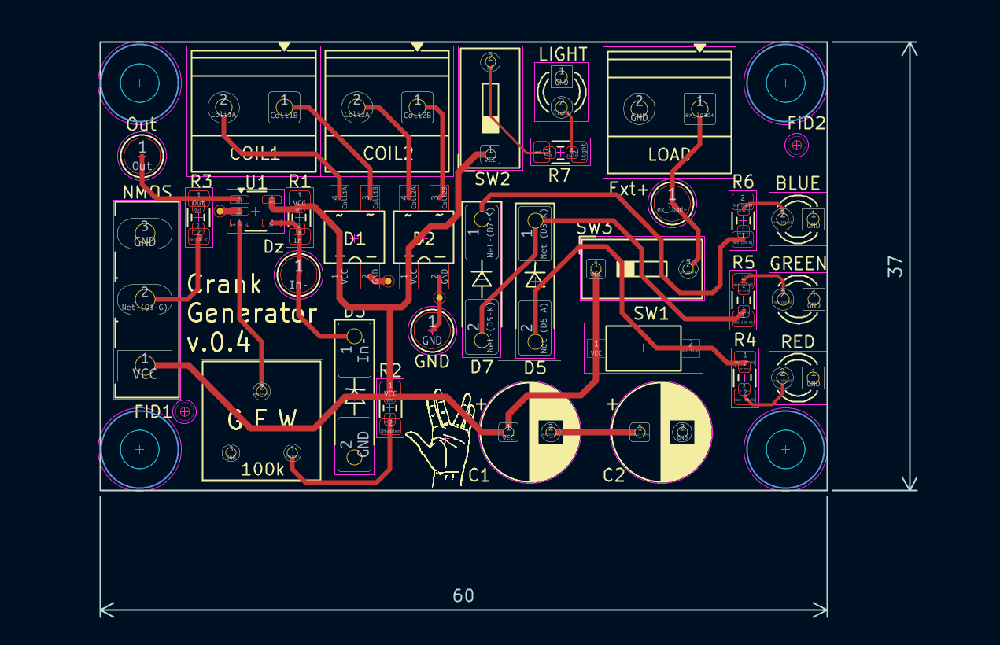
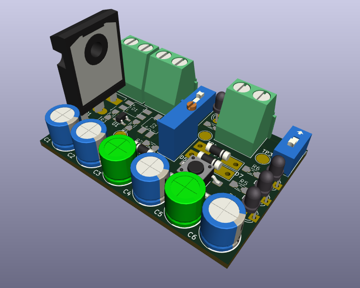
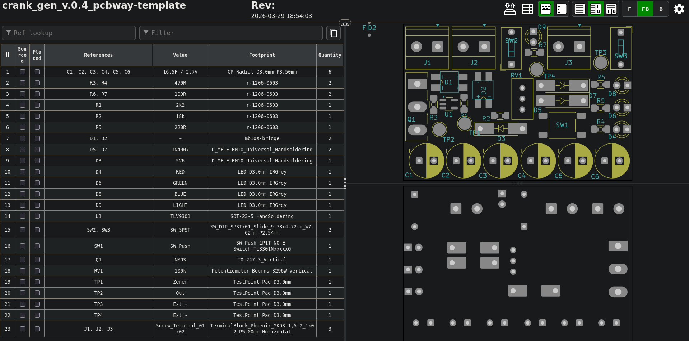

<video controls style="width: 90%; max-width: 700px; height: auto; display: block; margin: 0 auto;">
  <source src="../crank-gen-animation.mp4" type="video/mp4">
</video>

**Cel i przeznaczenie projektu:**

Głównym założeniem projektu było stworzenie prostego, zoptymaizowanego i niezawodnego w trudnych warunkach urzadzenia zdolnego do generowania energii elektrycznej w celu wytworzenia źródła światła oraz zasilenia potrzebnych urządzeń elektrycznych w warunkach off-grid (tj. telefon, powerbank, latarka, gps, radio).

!!! note annotate "Wykorzystane programy podczas pracy:"
    - KiCad — projekt schematu, symulacja, prototyp płytki PCB,
    - FreeCAD — projekt modelu 3D obudowy, eksport modelu do formatu siatki (STL/3MF),
    - OrcaSlicer - generowanie kodu G-code, wydruk modelu w drukarce 3D.

### Ideowy schemat blokowy:

### Schemat główny:

{ align=left }

**Opis schematu:**

Schemat przedstawia zamiane napięcia zmiennego generowanego z silnika krokowego w napięcie stałe poprzez dwa mostki gretza połączone równolegle. Układ zabezpieczający za mostkiem chroni superkondensatory przed przeładowaniem. Poziom naładowania kondensatorów definiują diody (czerwona, zielona, niebieska). Magazyn energi pozwala na zapalenie oświetlenia lub uruchomienie zewnętrznego obciążenia lub wywołania iskry poprzez rozgrzanie niklochromowanego przewodu podłąćzonego do wyjścia.

### Logika i zabezpieczenie:

{ align=center }

**Opis logiki:**

- Wykorzystanie silnika krokowego pozwala generowanie stałego poziomu napięcia,
- Połączenie mostrów gretza równolegle pozwala na ograniczenie napięcia do 5V oraz zwiększenie generowanego prądu,
- Wzmacniacz operacyjny porównuje napięcia na wejściu i aktywuje mosfet w momencie zarejestrowania napięcia powyżej dopuszczalnego 5,4V uniemożliwiając uszkodzenie się kondensatorów (zaletą tego układu brak strat energi jak w przypadku wykorzystania diody zenera - przez jej charaktrystyke narastającą 0,7V),
- Diody LED wizualnie pokazując ilość energi pozostałej w generatorze.

### Płytka PCB prototypu:

{ align=center }

**Opis PCB:**

- Footprinty zostały skonfigurowane w taki sposób aby wymiana elementów była jak najbardzieć uniwersalna (są w dwóch standardach 1206/0603 lub THT/SMD)
- Wspólna masa znajduje się na dolnej warstwie pcb.
- Ścieżki poprowadzone po górnej warstwie są wymiarów 15 mil, minimalne clearence 8 mil, dopuszczalny prąd nie powinien przekroczyć 2A.
- Rozmieszczenie elementów i ścieżek zaprojektowano z myślą o: 
  - efektywnym odprowadzaniu ciepła z elementów mocy, 
  - minimalizacji pętli masowych i zakłóceń EMI, 
  - wygodzie montażu i testowania.

### Wizualizacja obłożonego laminatu:

{ width="100%" style="display: block; margin: 0 auto;" }

### Lista komponentów (BOM):

{ align=center }

Powyżej tabela z kompletnym zestawieniem oraz opisem części potrzebnych do zbudowania ręcznego generatora. 

