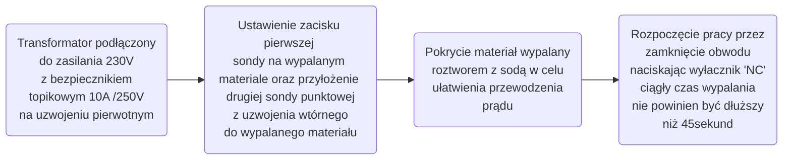
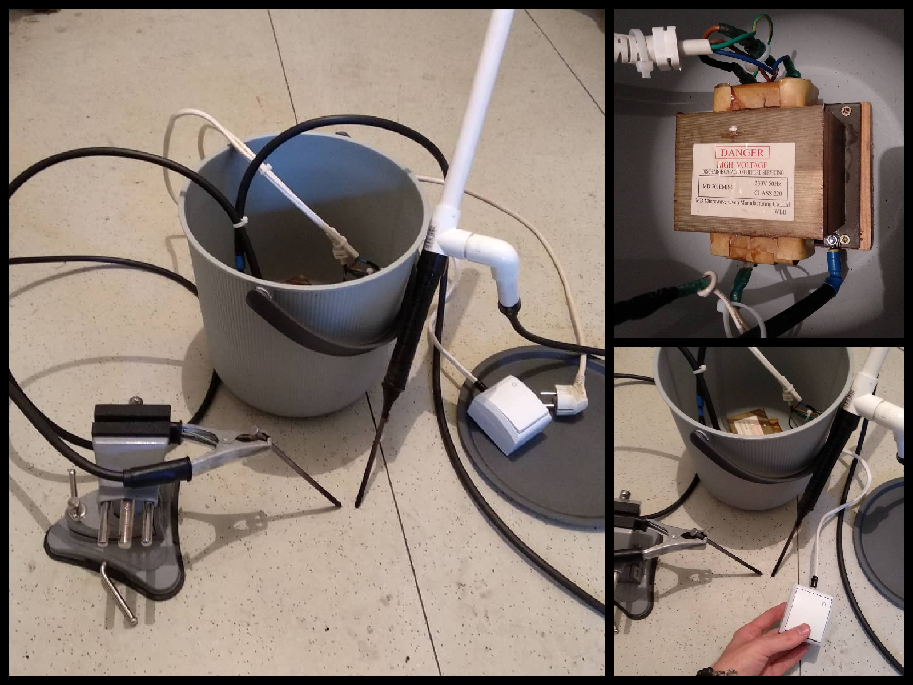
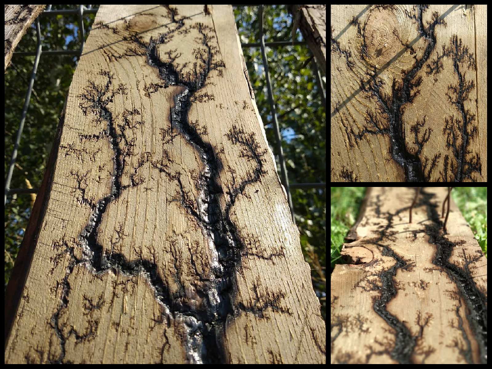

### Czym jest Generator piorunów Lichtenberga:

*To urzadzenie umożliwiające tworzenia sztucznych figur piorunów w izolatorach. Nazwa pochodzi od nazwiska niemieckiego fizyka, który jako pierwszy stworzył taki generator.*
    

### O czym należy wiedzieć przed rozpoczęciem pracy:

!!! info "BHP pracy z wysokim napięciem ⚠️"
    Praca z wysokim napięciem wymaga bezwzględnego przestrzegania procedur. Aby doszło do porażenia, ciało człowieka musi zamknąć obwód elektryczny. W praktyce dzieje się to na dwa sposoby:
    
    - Obwód Ręka–Ręka (Poprzeczny): Następuje przy dotknięciu obu elektrod jednocześnie. Prąd płynie bezpośrednio przez klatkę piersiową i serce. Jest to scenariusz, którego za wszelą cenę należy unikać,
    
    - Obwód Ręka–Stopa (Doziemny): Następuje przy dotknięciu nawet jednej elektrody, jeśli stoisz na nieizolowanym podłożu. Każde zamknięcie obwodu (zarówno lewa ręka–lewa noga, jak i prawa ręka–prawa noga) może być równie niebezpieczna jak zamknięcie obwodu Ręka–Ręka,
  
    - Złote zasady bezpieczeństwa na stanowisku to: Mata dielektryczna i obuwie izolacyjne.
    Są to obowiązkowe środki ochrony, które Izolują nogi od podłoża i całkowicie blokują niebezpieczny obwód ręka-stopa,
  
    - Zasada jednej ręki: Pracując przy obwodzie pod napięciem, operuj tylko jedną ręką. Druga ręka musi być schowana, co fizycznie uniemożliwia zamknięcie obwodu ręka-ręka.
    
    PAMIĘTAJ: Mata izolacyjna pod stopami chroni Cię przed przebiciem do ziemi, ale w żaden sposób nie chroni Cię, jeśli dotkniesz obu elektrod jednocześnie obiema rękami!

  

!!! note annotate "**Uwaga:**"
    - Ważne aby jedną ręką operować sondą punktową a drugą kontrolować prace obwodu wyłącznikiem NC,

    - Pod żadnym pozorem należy nie dotykać obiema rękami sond podczas pracy.,

    - Dodatkowo podczas pracy wskazane jest izolowane obuwie lub znajdowanie się na macie izolacyjnej.

**Diagram ideowy pracy z urządzeniem:**

**Prototyp generatora:**

{ width="100%" style="display: block; margin: 0 auto;" }

| 
Wyjaśnienie konstrukcji: |
| --- | 
|  <ul><li>Umieszczenie całego obwodu dodatkowo izoluje go uniemożliwiając przypatkowy dotyk uzwojenia transformatora, | 
| <ul><li>Pierwsza sonda jest zaciskiem umieszczonym sztywno przy wypalanym drewnie, |
| <ul><li>Druga sonda jest punktowa na izolowanym przedłużeniu służącym do manipulowania trasy powstających piorunów, |
| <ul><li>Układ działa tylko w momencie przyciskania wyłącznika NC, co zapewnia dodatkowe bezpieczeństwo podczas pracy dotykając tylko jedną sondę na raz oraz pełną kontrole nad zasilaniem obwodu. |

**Prezentacja sztucznie wytworzonego piorunu:**

<video controls style="width: 70%; max-width: 400px; height: auto; display: block; margin: 0 auto;"><source src="/img-and-mp4/projekty_wlasne/luk2.mp4" type="video/mp4"></video>

**Efekt końcowy wypalanych figur w drewnie:**

{ width="100%" style="display: block; margin: 0 auto;" }

