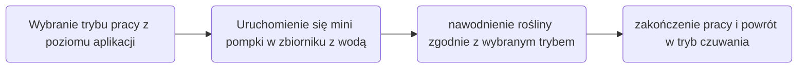
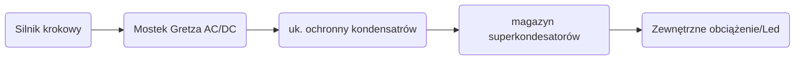

-- gif --

### Cel i przeznaczenie projektu:

!!! note annotate "Wykorzystane programy podczas pracy:"
    - KiCad — projekt schematu, symulacja, prototyp płytki PCB,
    - FreeCAD — projekt modelu 3D obudowy, eksport modelu do formatu siatki (STL/3MF),
    - OrcaSlicer - generowanie kodu G-code, wydruk modelu w drukarce 3D.

### Ideowy schemat blokowy:

### Schemat główny:

**Opis schematu:**

### Płytka PCB prototypu:

**Opis PCB:**

### Wizualizacja laminatu:

### Lista komponentów (BOM):