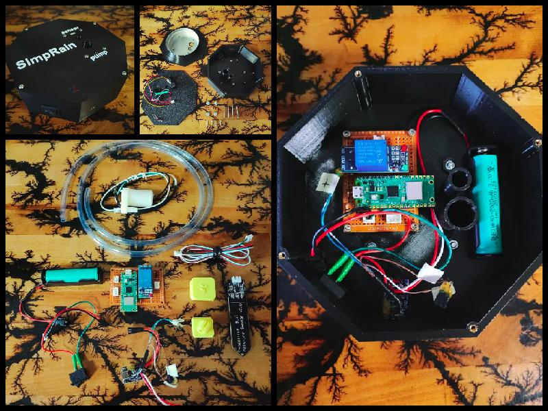
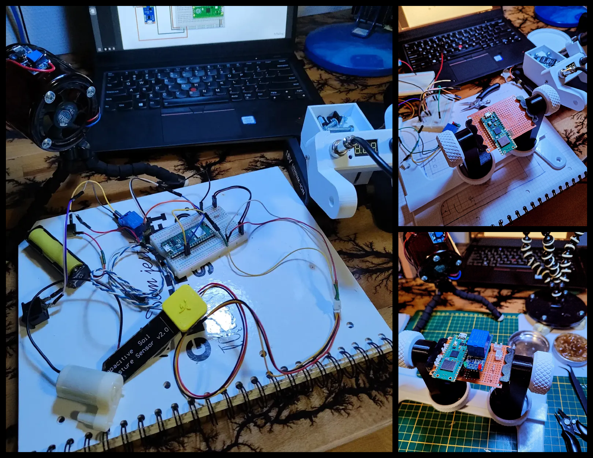
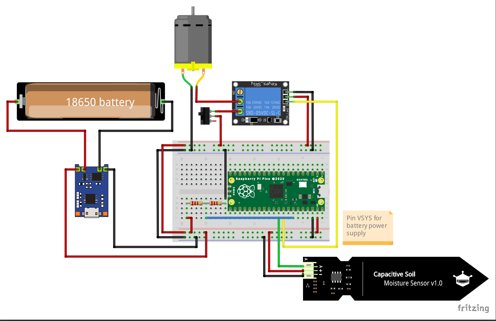
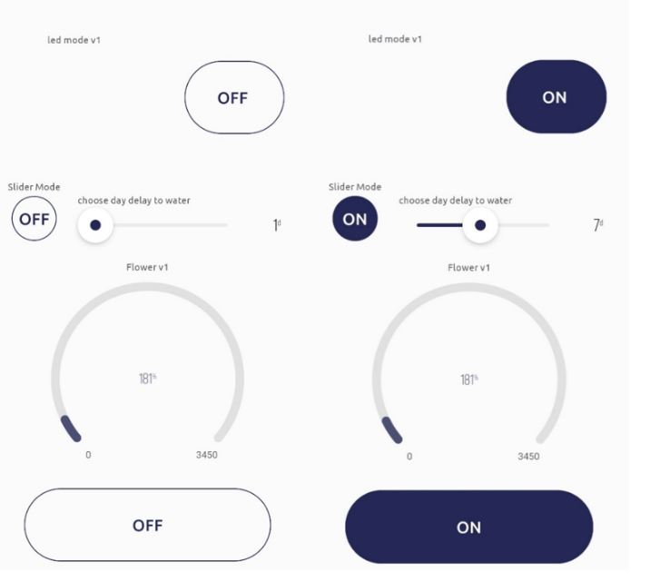
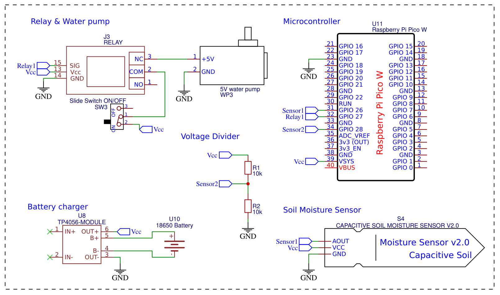
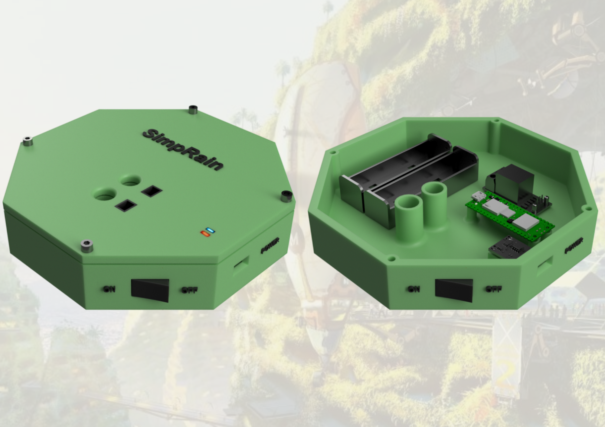
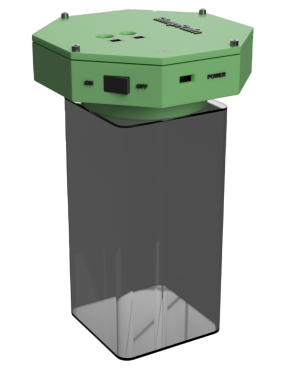

<video controls style="width: 70%; max-width: 400px; height: auto; display: block; margin: 0 auto;"><source src="/img-and-mp4/projekty_wlasne/water-plant.mp4" type="video/mp4"></video>

<video controls style="width: 70%; max-width: 400px; height: auto; display: block; margin: 0 auto;"><source src="../img-and-mp4/projekty_wlasne/water-plant.mp4" type="video/mp4"></video>

### Cel i przeznaczenie projektu:

Automatyczny system nawadniania roślin w mieszkaniu. Sterowany przez telefon z aplikacją sieci po WiFi. Wyposażony w trzy tryby pracy. Przeznaczony dla osób, które  często podróżują i często nie mają możliwości być fizycznie aby podlać rośliny w mieszkaniu.

{ width="100%" style="display: block; margin: 0 auto;" }

### Złożenie projektu:

{ width="100%" style="display: block; margin: 0 auto;" }

### Fragment z testów prototypów:

{ width="100%" style="display: block; margin: 0 auto;" }

**Test poprawności komunikacji z aplikacją:**

<video controls style="width: 70%; max-width: 400px; height: auto; display: block; margin: 0 auto;"><source src="../img-and-mp4/projekty_wlasne/water-plant-test1.mp4" type="video/mp4"></video>

!!! note annotate "Wykorzystane programy podczas pracy:"
    - LibrePCB — projekt schematu, prototyp płytki PCB,
    - Fritzing - projekt połączenia modułów systemu,
    - Fusion360 — projekt modelu 3D obudowy, eksport modelu do formatu siatki (STL/3MF),
    - OrcaSlicer - generowanie kodu G-code, wydruk modelu w drukarce 3D,
    - Blynk2.0 - aplikacja do sterowania systemem po Wi-Fi.

### Połączenie modułów w systemie:

{ align=left }

Po wybraniu trybu pracy z aplikacji procesor w raspberry pi wysyła sygnał uruchamiający przekaźnik, który włącza silnik mini pompki wodnej.
Pompka zaczyna pompować wode ze zbiornika, w którym się znajduje po czym kończy swoją prace i wysyła informację zwrotną.
Pojemnościowy czujnik wilgotności gleby mierzy poziom wody w glebie i uruchamia się gdy poziom spadnie tylko gdy zostanie uruchomiony w trybie 3.
Następnie procesor przesyła sygnał przejścia w tryb uśpienia minimalizujacy pobór prądu czekając na następne polecenia.

### Panel aplikacji sterującej:

{ width="100%" style="display: block; margin: 0 auto;" }

**Aplikacja posiada trzy tryby sterowania:**

- Tryb 1 - Manualne jedno razowe podlanie rośliny przez czas 2 sekund.

- Tryb 2 - Możliwość wyboru po jakiej liczbie dni zostanie roślina nawodniona (przeznaczone w sytuacjach, w których osoba wie ile dni jej nie bedzie) W

- Tryb 3 - Uruchomienie czujnika wilgotności gleby, który po wykryciu spadku wilgotności gleby rozpocznie proces nawadniania do momentu aż poziom wzrósnie do wybranego zakresu a następnie będzie monitorował czy poziom wilgotności nie spadł ponownie (przeznaczenie w sytuacjach, w których osoba nie wie ile dni jej nie bedzie).

- Dodatkowo jest możliwość sprawdzenia poziomu baterii w systemie z poziomu aplikacji oraz zapytanie w jakim trybie jest obecnie system.

### Schemat główny projektu:

{ align=left }

Jako układ sterujący wybrano raspberry pi zero ze względu na niski pobór napięcia oraz komunikacje Wi-Fi i bluetooth.
System zasilany jest z jednej lub dwóch baterii 18650 4,2V 2000mA. Ładowanie ogniw odbywa się za pośrednictwem przewodu USB C z wykorzystaniem modułu TP4056 przenaczonego do ogniw Liowo-jonowych. Moduł przekaźnika dostaje sygnał z procesora uruchamiając mini pompe wodną. Pojemnościowy czujnik wigotności monitoruje jej poziom wilgotności i zostaje wyzwolony w momencie obniżenia się poziomu wody w glebie tylko gdy zostanie uruchomiony jego tryb w aplikacji. Dzielnik napięcia rejestruje poziom baterii w ogniwach i wysyła wiadomość w momencie gdy napięcie bedzię w określonym minimum.

### Wizualizacja modelu 3D obudowy systemu:

{ align=left }

{ align=center }
