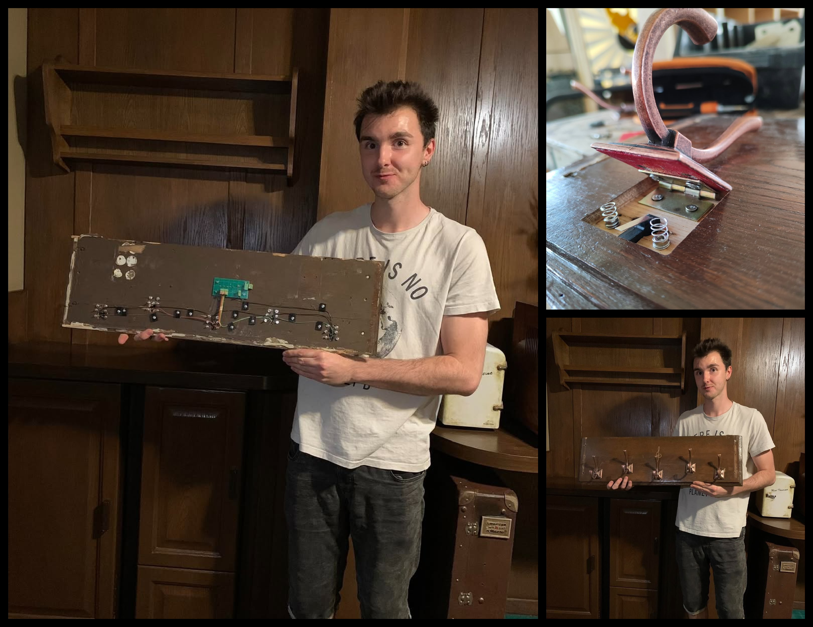
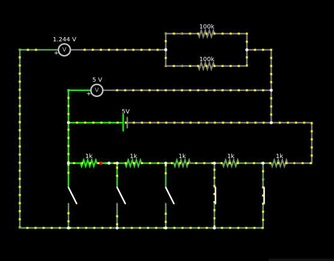
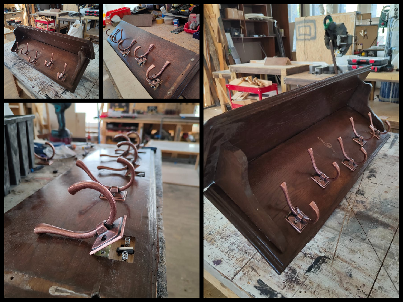
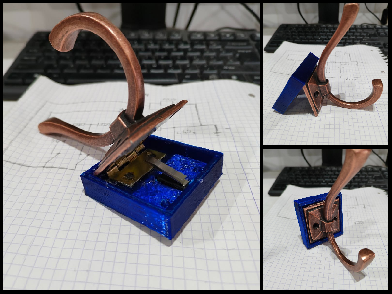

---

!!! abstract annotate "**Wprowadzenie do zagadki:** "
    Muzyczny wieszak jest to element zagadki Escape Room z motywem **Motelu California**. Wraz ze znajomymi wcielasz się w poszukiwaczy swojej przyjaciółki, która zagineła po nocy spedzonej w tym zagadkowym motelu.

    Aby odblokować ukryte drzwi należy rozwiązać zagadkę, której elementem jest wspomniany **Muzyczny Wieszak**. 
    W tle w pokoju hotelowym gra muzyka z gramofonu, która jest formą podpowiedzi. W uchwytach wieszaka są wmontowane wyłączniki krańcowe których naciśniecie po przez powieszenie znalezionych części garderoby na chaczyki skutkuje wydaniem pojedyńczego dźwieku. Celem jest naciśnięcie uchwytów w rytm granej melodi przez gramofon.

{ align=left }

---

{ width="100%" style="display: block; margin: 0 auto;" }

**Opis działania:** Ukryty za wieszakiem obwód elektryczny składa się z 5-ciu wyłączników krańcowych odzielonych rezystorami o różnej wartości. Wciśnięcie krańcówki powoduję zamknięcie obwodu i wydanie dźwieku z zewnętrznego głośnika. Odpowiednia kombinacja wciśniętych krańcówe, która wydaje dźwiek zbliżony do granej podpowiedzi przez gramofon w tle wysyła sygnał sterujący do jednostki sterującej, która zwalnia blokade w ukrytych drzwiach i je otwiera.

## Wizualizacja etapów procesu:

{ width="100%" style="display: block; margin: 0 auto;" }

{ width="100%" style="display: block; margin: 0 auto;" }

  
  <!-- Pierwsze wideo -->
  <video controls muted style="flex: 1; width: 45%; max-width: 400px; height: auto; border-radius: 8px;">
    <source src="../sw1.mp4" type="video/mp4">
    Przeglądarka nie obsługuje tagu wideo.
  </video>

  <!-- Drugie wideo -->
  <video controls muted style="flex: 1; width: 45%; max-width: 400px; height: auto; border-radius: 8px;">
    <source src="../frezz1.mp4" type="video/mp4">
    Przeglądarka nie obsługuje tagu wideo.
  </video>

