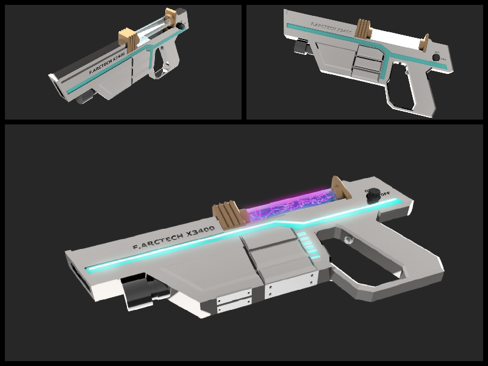
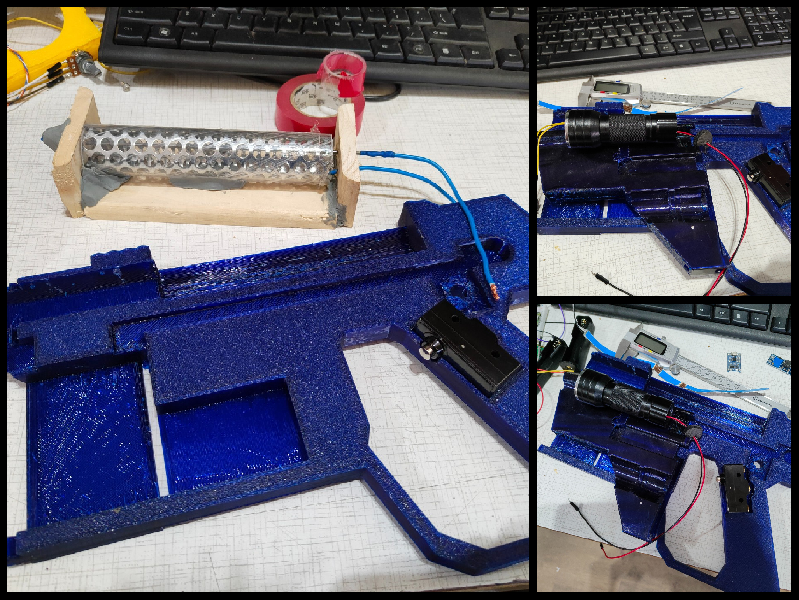
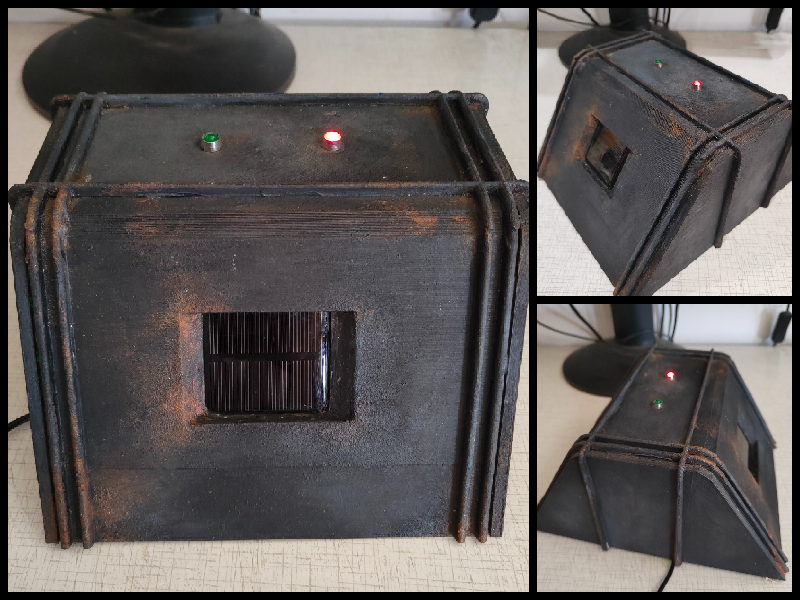

<video controls style="width: 90%; max-width: 700px; height: auto; display: block; margin: 0 auto;">
  <source src="../laser_gun_animation.mp4" type="video/mp4">
</video>

!!! note annotate "**Wprowadzenie do zagadki:** "
    **Pistolet Laserowy** jest elementem zagadki Escape Room na podstawie gry Resident Evil.
    Wraz ze znajomymi znajdujesz się w opuszczonym gabinecie generała, z którego musicie się wydostać uciekając od potworów przez lochy.

    Aby otworzyć bramę, która prowadzi do wyścia piwnicy należy skierować wiązke lasera na ukryte **odbiorniki laserowe** znajdujące się na ścianach. 
    Przytwierdzona **latarka UV** do pistoletu ułatwia znalezienie odbiorników, które są oznaczone fluorescencyjna farba.

### Wizualizacja 3D pistoletu laserowego:

{ width="100%" style="display: block; margin: 0 auto;" }

### Fragment z testów prototypów:

{ width="100%" style="display: block; margin: 0 auto;" }

**Test izolacji wysokiego napięcia w module ładowania:**

<video controls style="width: 45%; max-width: 400px; height: auto;"><source src="../coil-test1.mp4" type="video/mp4"></video><video controls style="width: 45%; max-width: 400px; height: auto;"><source src="../coil-test2.mp4" type="video/mp4"></video>

**Opis działania:** Konstrukcja przypominająca futurystyczny pistolet laserowy została wykonana z modelu 3D w Fusion360, a następnie została pomalowana i wdrukowana na drukarce 3D. W konstrukcji znajduje się dioda laserowa o dużej mocy z prostym modułem czasownym na bazie timer 555. Przytrzymanie spusty pozwala na uruchomienie wiązki lasera na czas 5 sekund. Po upływie tego czasu układ przerywa wiązke lasera symulując tym ładowanie się po przez efektywne wyładowania wysokiego napięcia cewki tesli, która jest odizolowana w szklanym zbiorniku pistoletu.

### Model odbiornika fotowoltaicznego:

{ align=left }

**Opis działania:** Odbiorni fotowoltaiczny wykorzystuje arduino z ogniwem fotowoltaicznym nano oraz dwie diody sygnalizacyjne. Dioda znajdująca się po prawej stronie służ jako ułatwienie znalezienie odbiorników na ścianie oraz wskazuje że cały układ działa poprawnie. Dioda po lewej stronie reaguje na stan ogniwa fotowoltaicznego, jeżeli wiązka światła zostanie skierowana na ogniwo dioda się zapali. Po zapaleniu się pięciu takich odbiorników mechanizm blokujący drzwi zostaje zwolniony i drzwi zostają otwarte.

<video controls style="width: 70%; max-width: 400px; height: auto; display: block; margin: 0 auto;"><source src="../recive.mp4" type="video/mp4"></video>

