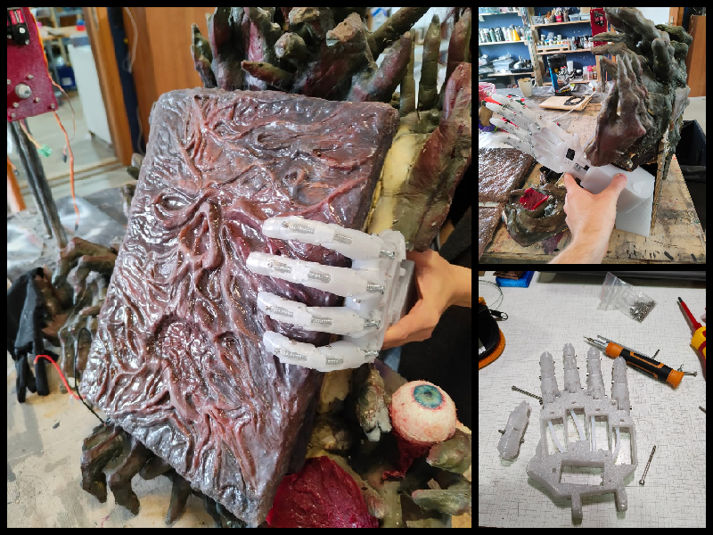

!!! note annotate "**Wprowadzenie do zagadki:** "
    Statyw do Księgi Zła jest to element zagadki Escape Room z motywem Domu Zła. Wraz ze znajomymi wcielasz się w grupe zagubionych podróżników, którzy odnaleźli dom w środku lasu i próbują odkryć jego historie.
    
    Aby otworzyć ukrytą skrytkę w ścianie prowadzącą do dalszej części zagadaki należało wykorzystać informacje zawarte w księdze zła, która była niedostępna przez trzymaną bioniczną ręke w statywie.

## Wizualizacja modelu dłoni w docelowym statywie:

{ align=left }

**Opis działania:** Mechanizm blokujący oparty na elektromagnetycznym zaczepie blokady do drzwi unieruchamiał trzymaną w statywie księgę.
 Wydrukowany model 3D ręki został złożny i dodano do niego ścięgna z naprężonych sprężyn, które uniemożliwiały  wyjęcie księgi ze statywu ręcznie.
 Aby uzyskać dostęp do księgi należało odpowiednio ułożyć książki znajdujące się na regale. Wtedy mechanizm blokujący zostawał zwolniony i umożliwił dostęp do księgi.
  
---

**ujęcie pierwszej próby :) bez dostosowanie ciężaru książki**

<video controls style="width: 70%; max-width: 400px; height: auto; display: block; margin: 0 auto;"><source src="img-and-mp4/projekty_praca/book.mp4" type="video/mp4"></video>

