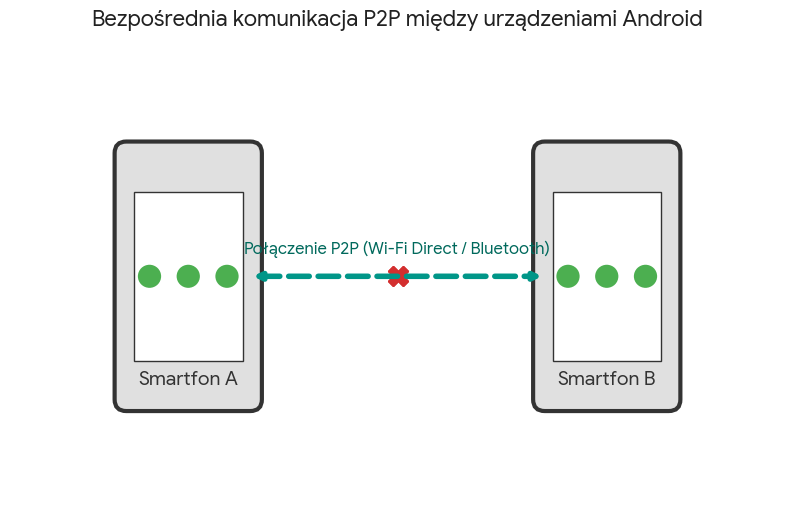
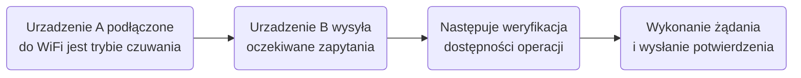

!!! abstract "Cel i przeznaczenie:"
    **Celem projektu** było stworzenie prostego, prywatnego połączenie między dwoma urządzeniami do komunikacji oraz przesyłu danych przez internet.

    **Potencjalne zastosowania:** Monitoring zwierzat w domu bez udostepniania wrażliwych danych osobom trzecim,  Namierzenie lokalizacji swoich własności(samochód, łódź), Wykrywanie obecności w mieszkaniu oraz zawiadomienia o takim zajściu.

### Poglądowe wyjaśnienie komunikacji:

{ width="100%" style="display: block; margin: 0 auto;" }

### Założenia projektowe:

1. Możliwość wykorzystania starych urządzeń z androidem z dostępem bez konieczności root'owania systemu - **Termux**

2. Szybka komunikacja sieciowa, lekka w przesylaniu danych bez obciążania procesora starszych urządzeń - **Flask**

3. Możliwość komunikacji poza siecia lokalna wykorzystalem - **Tailscale** 

4. Możliwość stworzenia skrótów komend do szybkiej i wygodnej pracy - **HTTP Shortcut** 

### Możliwa funkcjonalność połączenie HTTP:

| Funkcjonalność:       | Opis funkcji:                                                                                                                     |
|---------------------------|-------------------------------------------------------------------------------------------------------------------------------------|
| • Stan baterii | Odczytanie poziomu naładowania urządzenia,                               |
| • Wibracja      | Uruchomienia wibracji urządzenia (symulowanie dostania SMS), |
| • Włączenie/Wyłączenie lampy    | Zdalne uruchonienie lampy kamery,    |
| • Zdjęcie  | Wykonania i przesłanie zdjęcia wybranym aparatem (przedni lub tylny) do drugiego urządzenia,                         |
| • Nagranie  | Wykonania i przesłanie nagrania wybranym aparatem (przedni lub tylny) do drugiego urządzenia,        |
| • Lokalizacja GPS  | Odczytania gdzie dokładnie znajduje się urządzenie,                        |
| • Monitoring z funkcją wykrycia ruchu  | Wykonywanie zdjęć do 10 sekund, konwerterowanie ich w plik *.mp4* oraz przesyłanie ich na drugie urządzenie po wykryciu ruchu.                        |

### Testy etapów komunikacji w procesie powstawania projektu:

??? example "Opis etapów testowych:"
    ### 📱 TEST 1 - Konfiguracja i odczyt zapytań w Termux:
    Sprawdzenie działania podstawowych funkcji połączenia. Stworzenie skryptu testującego lokalne zapytania; (Vibrate, Lamp On/Off, Camera, GPS)
    
    

    [**Przejdź do opisu - Testu 1**](../testy_polaczenie_http/test1_termux.md)

    

    ### 🌐 TEST 2 - Komunikacja Flask w sieci lokalnej:
    Sprawdzenie połączenia oraz komunikacji na wysyłane zapytania do urządzeń i ich odpowiedzi.

    

    [**Przejdź do opisu - Testu 2**](../testy_polaczenie_http/test2_komunikacja.md)

    

    ### 📁 TEST 3 - Przesyłanie plików w sieci lokalnej:
    Sprawdzenie czy przesłane pliki docierają do drugiego urządzenia do wskazanego folderu oraz w wybranym formacie. Sprawdzenie czy przestarzałe pliki zostają skasowane.

    

    [**Przejdź do opisu - Testu 3**](../testy_polaczenie_http/test3_przesylanie.md)

    

    ### 🛡️ TEST 4 - Przetestowanie działania zapytań poza siecią lokalną:
    Utworzenie prywatnego połączenia dla obu urządzeń oraz sprawdzenie działania zapytań w różnych sieciach z wykorzystaniem Tailscale.
    

    [**Przejdź do opisu - Testu 4**](../testy_polaczenie_http/test4_tailscale.md )

    

    ### ⚡ TEST 5 - Zarządzanie zapytaniami w aplikacji HTTP Shortcut:
    Utworzenie przycisków skrótów do zapytań w API bez udziału Termux oraz sprawdzenie sprawności połączenia.    
    

    [**Przejdź do opisu - Testu 5**](../testy_polaczenie_http/test5_app_short.md)

    
   

### Gotowy projekt połączenia peer-to-peer:

!!! tip "Opis działania: "
    ### 🏃‍♂️ Monitoring z funkcją wykrycia ruchu:
    Urządzenie z androidem jest podłączone do sieci Wi-Fi w mieszkaniu. Po uruchomieniu trybu pracy w aplikacji (HTTP shortcut) tylna kamera zostaje włączona i robi zdjęcia do 2 sekundy oraz co 60 sekund wysyła relacje zdjęć na drugie urządzenie z androidem w przeznaczonym na to folderze. W przypadku przepełnienia pamięci (ponad 2000 zdjęć) starsze zdjęcia zostają automatycznie usuwane. W momencie wykrycia ruchu robione zdjęcia zostają po przesłaniu przekonwerterowane w 10 sekundowe nagranie i wysłane do drugie urządzenie. 
    
    --- **do poprawy logika mniej więcej czy tak jest naprawde** ---

    

    [**Kliknij tutaj - aby dowiedzieć się więcej**](../testy_polaczenie_http/efekt_koncowy.md)

    
 

