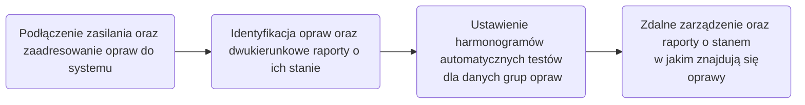

# DALI (Digital Addressable Lighting Interface) 

!!! info "Czym jest DALI?"

    -  To międzynarodowy, standard służący do inteligentnego sterowania oświetleniem w budynkach. Umożliwia  dwukierunkową wymianę danych pomiędzy centralnym kontrolerem a poszczególnymi lampami w budynku,
 
    -  Komunikacja bazuje na normie **IEC 62386**, która definiuje zasady przesyłu sygnałów. W przypadku oświetlenia awaryjnego isotne części to: **IEC 62386 - 101** (wymagania ogólne) i **IEC 62386 -102** oraz część **IEC 62386 - 202**, określająca szczegółowe procedury dla urządzeń zasilanych z baterii,

    -  Protokół eliminuje potrzebę ręcznego,  sprawdzania lamp awaryjnych w systemie. Rozwiązuje on problem licznego okablowania, pozwalając na dowolne grupowanie opraw z poziomu panelu aplikacji. System automatyzuje testy bezpieczeństwa i  generuje gotowe raporty określone w zaplanowanych harmonogramach,
    
    - Dzięki certyfikacji urządzeń w **standardzie DALI-2** urządzenia różnych producentów mają zapewnione stabilnie i bezawaryjnie działanie.

## Poglądowe działanie protokołu komunikacyjnego DALI:

## Powody stosowania komunikacji w oświetleniu awaryjnym:

??? info "Do głównych zalet komuniakcji należą:"

    - **Adresowalność:** Każde urządzenie ma swój unikalny adres. Układ sterujący może wysyłać komendy do danych grup produktów lub do wszystkich na raz.

    - **Dwukierunkowość:** System pozwala na płynne wysyłanie danych w obie strony, co oznacza że oprawy mogą przyjmować polecenia (np: o ściemnieniu do 30%) oraz mogą wysyłać raporty o stanie lub o wykrytej awarii.
    
    - **Napięcie magistrali:** Do przesyłania sygnałów i zasilania magistrali służą dwa przewódy pracujące na napięciu od 16V do 20V. Polaryzacja nie ma znaczenia przy podłączaniu, co ułatwia montaż. Komunikacja działa stabilnie nawet w bardzo dużych budynkach.
    
    - **Połączenie równoległe:** Oprawy łączone są równolegle jeden kanał obsługuje do 64 oprawy na kanał, gdzie uszkodzenie jednej oprawy nie przerywa pracy pozostałych, a rozbudowa o kolejne linie ułatwia bezpieczny podział budynku na strefy pożarowe.
    
    - **Testowanie sekwencji i scenariuszy:** System pozwala utworzyć automatyczne testy sprawności oświetlenia awaryjnego. Weryfikowane urządzeniami pomiarowymi tj<;> **Probitbench** oraz **Picoscope 7777**, co daje pewność zgodności z oficjalnymi normami.

    - **Integracja z aplikacjami zarządzającymi:** System umożliwia centralny podgląd obiektu, automatyczne zbieranie danych oraz generowanie raportów bezpieczeństwa w standardzie **DALI-2.** Dzięki członkostwu firmy w **DALI Alliance** instalacja zapewnia pełną kompatybilność z zaawansowanymi systemami sterowania, takimi jak **Helvar Designer** oraz **Zen Control**.

---

## Na czym polegałą moja rola w tym projekcie:

*Za co byłem odpowiedzialny:*

1. **Przygotowaine prototypu układu dali na PCB:** Stworzenie podstawowego układu komunikacji na laminacie oprawy do receptury produktu na bazie wskazanych wytycznych,

2. **Przygotowanie stanowiska pomiarowego:** Stworzenie warunków do testów badanej oprawy podłączonej urządzenia weryfikującego zgodność ze standardem Dali-2 *Probitbench*, 
następnie wgranie sekwencji testówych z zakupionych norm do programu *Probitlab*. Podłaczenie oscyloskopy z sondami do oprawy *Picoscope 4444*. Podłączenie luksometru do oświetlenia główego oprawy, oraz okablowanie całego stanowiska pomiarowego  (==========================img -dodaj tu zdjecia==),

1. **Stworzenie bazy danych z wynikami sekwencji:** Utworzenie listy wszystkich testów sekwencji opisanych w normie. Stworzenie ticketu oraz opisanie każdego z nich bazując na wytycznych w normie oraz aktualizacja wyników, 

2. **Walidacja i weryfikacja oprogramowania wbudowanego:** Współpraca z zespołem programistow, któtrych zadaniem było przygotowanie rewizji software spełniającego wszystkie wymogi normy pod komunikacje DALI,

3. **Przygotowanie dokumentacji końcowej do jednostki certyfikacyjnej:** Przedstawienie końcowej rewizji software opraw awaryjnych oraz folderu zawierającego pozytywne wyniki sekwencji testowych wymaganych norm IEC 62386 -102, -202 do jednostki certyfikacyjnej.

