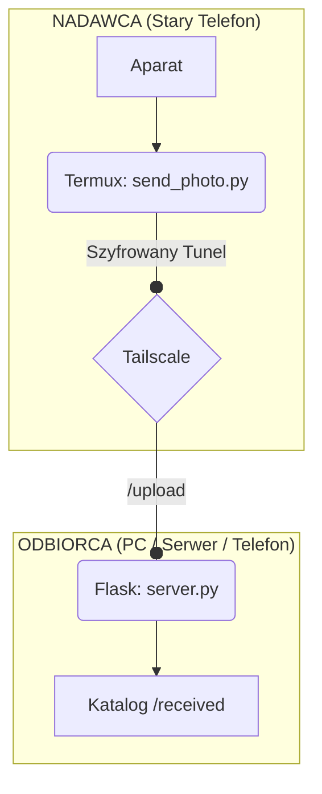
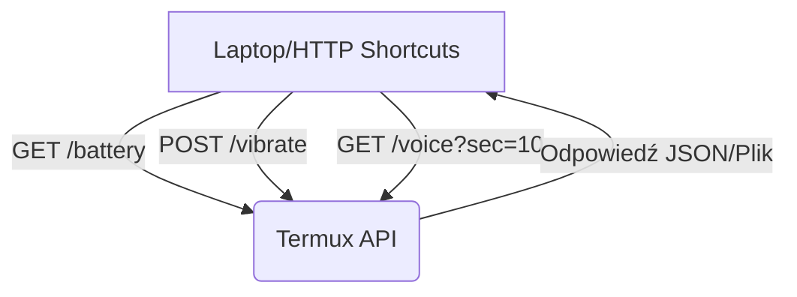

<div style="text-align: center;">


</div>


!!! note annotate "Cel projektu"
    Automatyczne przesyłanie zdjęć z telefonu w bezpieczny sposób przez internet (bez publicznego IP), z wykorzystaniem szyfrowanego tunelu Tailscale i lekkiego serwera Flask.


### Krok 1: Przygotowanie Nadawcy (Telefon w Termux)

Wykonaj jednorazową instalację pakietów i nadaj uprawnienia:


```
pkg update && pkg upgrade
pkg install python termux-api
pip install requests pillow
termux-setup-storage
```
Pamiętaj: Wejdź w ustawienia Androida i nadaj Termuxowi uprawnienia do Aparatu i Pamięci.


### Krok 2: Skrypt Nadawcy (send_photo.py)

Zapisz poniższy kod w Termuxie (```nano send_photo.py```). Skrypt robi zdjęcie, kompresuje je i wysyła do odbiorcy.

```

#!/usr/bin/env python3
import os, time, requests, datetime
from subprocess import run

# --- CONFIG ---
INTERVAL = 5                                  # Co ile sekund zdjęcie
DEST_URL = "http://100.x.y.z:5000/upload"     # IP TAILSCALE ODBIORCY
AUTH_TOKEN = "moja_tajna_token"
TMP_DIR = os.path.expanduser("~/pics_tmp")
JPEG_QUALITY = 75

os.makedirs(TMP_DIR, exist_ok=True)

def take_photo(path):
    # -c 0 = tylny aparat
    return run(["termux-camera-photo", "-c", "0", path]).returncode == 0

print(f"🚀 Start. Wysyłam zdjęcia co {INTERVAL}s na {DEST_URL}")

while True:
    ts = datetime.datetime.now().strftime("%Y%m%d_%H%M%S")
    filename = f"photo_{ts}.jpg"
    path = os.path.join(TMP_DIR, filename)

    if take_photo(path):
        # Próba kompresji Pillow
        try:
            from PIL import Image
            img = Image.open(path)
            img.save(path, "JPEG", quality=JPEG_QUALITY)
        except: pass

        # Wysyłka
        with open(path, "rb") as f:
            files = {"file": (filename, f, "image/jpeg")}
            headers = {"Authorization": f"Bearer {AUTH_TOKEN}"}
            try:
                r = requests.post(DEST_URL, files=files, headers=headers, timeout=15)
                if r.status_code == 200:
                    print(f"✅ Wysłano: {filename}")
                    os.remove(path) # Usuń po wysłaniu
                else:
                    print(f"❌ Błąd serwera: {r.status_code}")
            except Exception as e:
                print(f"⚠️ Błąd połączenia: {e}")
    
    time.sleep(INTERVAL)

```

**Uruchomienie w tle:**

```
chmod +x send_photo.py
termux-wake-lock
python3 send_photo.py &


```

### Krok 3: Konfiguracja Odbiorcy (Flask Server)

Na komputerze lub drugim telefonie zainstaluj Flaska i stwórz ```server.py```:

```
from flask import Flask, request, abort
import os

app = Flask(__name__)

# --- CONFIG ---
SAVE_DIR = "received"
AUTH_TOKEN = "moja_tajna_token"
os.makedirs(SAVE_DIR, exist_ok=True)

@app.route("/upload", methods=["POST"])
def upload():
    # Weryfikacja tokena
    auth = request.headers.get("Authorization", "")
    if auth != f"Bearer {AUTH_TOKEN}":
        abort(401)
    
    if "file" not in request.files:
        abort(400)
        
    f = request.files["file"]
    f.save(os.path.join(SAVE_DIR, f.filename))
    return "OK", 200

if __name__ == "__main__":
    # Serwer słucha na wszystkich interfejsach (Tailscale również)
    app.run(host="0.0.0.0", port=5000)


```

### 4. Sieć i Bezpieczeństwo

|Element	| Opis|
| ----- | ---- |
|Tailscale |Upewnij się, że oba urządzenia są zalogowane. Używaj adresu ```100.x.y.z.```|
|Prywatność |Dzięki ```AUTH_TOKEN```, nikt w Twojej sieci Tailscale nie wyśle Ci niechcianych plików.|
|Czyszczenie |Na odbiorcy (Linux/Mac) możesz dodać crona: find ```./received -mtime +7 -delete```.|


### 5. Rozwiązywanie problemów (FAQ)


|Problem |	Rozwiązanie|
| ----- | -----|
| Błąd 401 | Sprawdź czy ```AUTH_TOKEN``` jest identyczny w obu skryptach.|
|Zbyt wolno | Zwiększ ```INTERVAL``` lub zmniejsz ```JPEG_QUALITY``` do ```50```. |
|ermux się wyłącza | Upewnij się, że wpisałeś ```termux-wake-lock``` i wyłączyłeś optymalizację baterii dla Termuxa w Androidzie.|

---

---

## Rozbudowanie programu o dodatkową funkcjonalność (battery status, vibrate, voice record)

<div style="text-align: center;">


</div>

!!! note annotate "Nowe Funkcje Serwera"
    Do działania tych funkcji wymagany jest zainstalowany pakiet Termux:API (zarówno w systemie Android, jak i wewnątrz Termuxa komendą pkg install termux-api).


Zaktualizowany Kod Serwera (server_api.py)


```
#!/usr/bin/env python3
from flask import Flask, request, send_file, abort, jsonify
import subprocess
import os
import time

app = Flask(__name__)

# --- KONFIGURACJA ---
AUTH_TOKEN = "moja_tajna_token"
TEMP_DIR = os.path.expanduser("~/storage/pictures/TermuxAPI")
os.makedirs(TEMP_DIR, exist_ok=True)

def check_auth():
    auth = request.headers.get("Authorization", "")
    if auth != f"Bearer {AUTH_TOKEN}":
        abort(401)

# 1. STATUS BATERII
@app.route("/battery-status", methods=["GET"])
def battery():
    check_auth()
    res = subprocess.run(["termux-battery-status"], capture_output=True, text=True)
    return res.stdout, 200, {'Content-Type': 'application/json'}

# 2. WIBRACJA
@app.route("/vibrate", methods=["POST"])
def vibrate():
    check_auth()
    # Pobierz czas trwania z parametrów (domyślnie 1000ms)
    ms = request.args.get("ms", "1000")
    subprocess.run(["termux-vibrate", "-d", ms])
    return jsonify({"status": f"Vibrated for {ms}ms"}), 200

# 3. NAGRYWANIE GŁOSU
@app.route("/voice", methods=["GET"])
def voice():
    check_auth()
    # Parametr 'sec' określa długość nagrania
    seconds = request.args.get("sec", "5")
    path = os.path.join(TEMP_DIR, "audio_record.m4a")
    
    print(f"Nagrywam przez {seconds}s...")
    subprocess.run(["termux-microphone-record", "-l", seconds, "-f", path])
    
    # Odczekaj chwilę na zapisanie pliku
    time.sleep(int(seconds) + 1)
    
    if os.path.exists(path):
        return send_file(path, mimetype='audio/mp4')
    return jsonify({"error": "Nie udało się nagrać dźwięku"}), 500

if __name__ == "__main__":
    app.run(host="0.0.0.0", port=8080)
```

**Jak testować nowe funkcje?**
Możesz użyć komend curl lub dodać nowe przyciski w HTTP Shortcuts:

|Funkcja| Komenda|
|-----|-----|
|1. Sprawdzenie baterii:| ``` curl -H "Authorization: Bearer moja_tajna_token" http://100.x.y.z:8080/battery-status ```|
|2. Uruchomienie wibracji (2 sekundy):| ``` curl -X POST -H "Authorization: Bearer moja_tajna_token" "http://100.x.y.z:8080/vibrate?ms=2000" ```|
|3. Nagranie 10 sekund dźwięku i pobranie pliku:| ``` curl -H "Authorization: Bearer moja_tajna_token" "http://100.x.y.z:8080/voice?sec=10" --output nagranie.m4a ```|


**Co się zmieniło w kodzie**

|Funkcja| opis|
|-----|-----|
|/battery-status:| Wykorzystuje systemowe narzędzie termux-battery-status, które zwraca dane o poziomie naładowania, temperaturze i stanie ładowania.|
|/vibrate:| Pozwala "zatrząść" telefonem zdalnie. Dodałem parametr ?ms=, dzięki któremu możesz kontrolować długość wibracji.|
|/voice:| Używa termux-microphone-record. Plik jest zapisywany tymczasowo w pamięci, a następnie wysyłany do Ciebie jako plik .m4a (możesz go odtworzyć w każdym odtwarzaczu).|


Pamiętaj: Przy pierwszym użyciu mikrofonu, Android może wyświetlić na ekranie telefonu prośbę o zezwolenie na nagrywanie dźwięku dla aplikacji Termux.


---

---

---

## Rozbudowanie programu o dodatkową funkcjonalność (location)

```
#!/usr/bin/env python3
from flask import Flask, request, send_file, abort, jsonify
import subprocess
import os
import time

app = Flask(__name__)

# --- KONFIGURACJA ---
AUTH_TOKEN = "moje_foto_2024"
BASE_DIR = os.path.expanduser("~/storage/shared/Download/TermuxRemote")
VOICE_PATH = os.path.join(BASE_DIR, "voice_record.opus")
PHOTO_PATH = os.path.join(BASE_DIR, "remote_snap.jpg")
os.makedirs(BASE_DIR, exist_ok=True)

def check_auth():
    auth = request.headers.get("Authorization", "")
    if auth != f"Bearer {AUTH_TOKEN}":
        abort(401)

# --- ENDPOINT: APARAT ---
@app.route("/capture", methods=["GET"])
def capture():
    check_auth()
    subprocess.run(["termux-camera-photo", "-c", "0", PHOTO_PATH])
    return send_file(PHOTO_PATH, mimetype='image/jpeg')

# --- ENDPOINT: BATERIA ---
@app.route("/battery-status", methods=["GET"])
def battery():
    check_auth()
    # Pobiera dane o baterii w formacie JSON przez Termux API
    res = subprocess.run(["termux-battery-status"], capture_output=True, text=True)
    return res.stdout, 200, {'Content-Type': 'application/json'}

# --- ENDPOINT: WIBRACJE ---
@app.route("/vibrate", methods=["GET"])
def vibrate():
    check_auth()
    # Pobiera czas wibracji z parametru ?ms=1000, domyślnie 500ms
    ms = request.args.get("ms", default="500")
    subprocess.run(["termux-vibrate", "-d", ms])
    return jsonify({"status": "vibrating", "duration": ms}), 200

# --- ENDPOINT: NAGRYWANIE GŁOSU ---
@app.route("/voice", methods=["GET"])
def voice():
    check_auth()
    # Pobiera czas nagrania z parametru ?sec=5, domyślnie 5s
    sec = request.args.get("sec", default="5")
    print(f"Nagrywanie: {sec}s...")
    
    # Nagrywanie dźwięku (format .opus jest lekki i wysokiej jakości)
    subprocess.run(["termux-microphone-record", "-d", sec, "-f", VOICE_PATH])
    
    # Poczekaj chwilę na sfinalizowanie pliku
    time.sleep(int(sec) + 0.5)
    
    if os.path.exists(VOICE_PATH):
        return send_file(VOICE_PATH, mimetype='audio/ogg')
    return jsonify({"error": "Nie udało się nagrać dźwięku"}), 500

if __name__ == "__main__":
    app.run(host="0.0.0.0", port=8080)
```

**Jak testować nowe funkcje? (Komendy curl)**
Teraz Twój "pilot" na laptopie lub w aplikacji HTTP Shortcuts ma nowe możliwości:

| Funkcja | Komenda|
|----|-----|
| 1. Sprawdzenie baterii: Zwróci: procent naładowania, temperaturę i informację, czy telefon jest pod ładowarką.| ```curl -H "Authorization: Bearer moje_foto_2024" http://100.x.y.z:8080/battery-status ```|
|2. Wibracja np. 2 sekundy): | ``` curl -H "Authorization: Bearer moje_foto_2024" "http://100.x.y.z:8080/vibrate?ms=2000" ```|
|3. Nagranie 10 sekund dźwięku i zapisanie na laptopie: |```curl -H "Authorization: Bearer moje_foto_2024" "http://100.x.y.z:8080/voice?sec=10" --output nagranie.opus ```|
 

Tabela uprawnień (Ważne!)

|Funkcja	|Uprawnienie w Androidzie|
| ---- | ---- |
|/voice	| Mikrofon|
| /battery-status	| Brak (dostępne domyślnie)|
|/vibrate	| Brak (dostępne domyślnie)|


**Co poprawiono w kodzie**

|Funkcja| opis|
|-----|-----|
|Dynamiczne parametry:| W /vibrate i /voice możesz teraz w komendzie curl decydować, jak długo mają trwać (?ms= lub ?sec=).|
|Lokalizacja: | Wszystkie pliki (zdjęcia i nagrania) trafiają do jednego folderu TermuxRemote w pamięci telefonu, żebyś mógł je łatwo przeglądać.|
|Mimetype:| Ustawiłem poprawne typy plików, więc przeglądarka lub aplikacja od razu rozpozna, że to obraz lub dźwięk.|


Czy chciałbyś dodać do tego funkcję "Lokalizacja" (/location), która zwróci współrzędne GPS telefonu?|