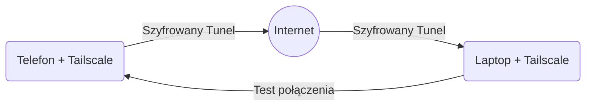
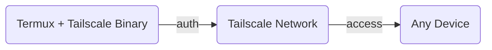

# Dokumentacja Techniczna Konfiguracji i Walidacji Połączenia Sieciowego Tailscale w Środowisku Termux

## 1. Architektura i Zasada Działania Połączenia

W celu pełnego zobrazowania mechanizmu przepływu pakietów danych oraz struktury uwierzytelniania w topologii sieciowej, poniżej przedstawiono dwa komplementarne schematy logiczne.

### Schemat 1: Przepływ Ruchu i Tunelowanie Danych
Poniższy schemat ilustruje sposób, w jaki ruch sieciowy z laptopa jest bezpiecznie tunelowany przez sieć publiczną (Internet) bezpośrednio do urządzenia mobilnego:



### Schemat 2: Autoryzacja i Rejestracja Węzła CLI
Poniższy schemat obrazuje proces translacji uprawnień i rejestracji binarnego klienta Tailscale bezpośrednio wewnątrz izolowanego środowiska Termux:



### Wyjaśnienie mechanizmu sieciowego

Wdrożone rozwiązanie opiera się na architekturze wirtualnej sieci prywatnej (VPN) typu mesh, realizowanej w topologii punkt-punkt (Peer-to-Peer). Proces nawiązywania i utrzymywania połączenia przebiega według następujących założeń:

1. **Wirtualizacja warstwy sieciowej:** Tailscale tworzy dedykowany interfejs sieciowy, przypisując każdemu urządzeniu stały adres IPv4 z puli `100.64.0.0/10`. Adresacja ta pozostaje niezmienna niezależnie od fizycznej lokalizacji urządzenia oraz zmian interfejsów dostępowych (np. przełączenie z sieci Wi-Fi na komórkową transmisję danych LTE/5G).
2. **Negocjacja tunelu (STUN/ICE):** Urządzenia komunikują się z serwerem koordynującym Tailscale w celu wymiany kluczy publicznych i ustalenia zewnętrznych adresów IP oraz portów. Po zakończeniu tej procedury ruch sieciowy jest kierowany bezpośrednio pomiędzy laptopem a telefonem (z pominięciem serwerów pośredniczących), co minimalizuje opóźnienia.
3. **Kryptografia:** Całość transmitowanych danych zostaje poddana obustronnemu szyfrowaniu przy użyciu protokołu WireGuard (szyfr ChaCha20-Poly1305). Zapewnia to integralność oraz poufność przesyłanych informacji w publicznych kanałach transmisji.

### Specyfika Wdrożenia: Aplikacja Android vs Binaria CLI Termux

Podczas projektowania środowiska sieciowego przeanalizowano dwa alternatywne warianty implementacji Tailscale na urządzeniu mobilnym. Wybór środowiska uruchomieniowego determinuje sposób zarządzania pakietami:

*   **Wariant A: Oficjalna aplikacja Tailscale (Android GUI)**
    *   *Charakterystyka:* Rejestruje się w systemie Android jako oficjalna usługa VPN. Przechwytuje i szyfruje ruch sieciowy generowany przez wszystkie aplikacje w systemie.
    *   *Zalety:* Łatwa konfiguracja poprzez interfejs graficzny, automatyczne zarządzanie kluczami i stabilne podtrzymywanie połączenia przez system operacyjny.
    *   *Zastosowanie:* Scenariusze, w których telefon pełni rolę klienta uzyskującego dostęp do innych zasobów w sieci Tailscale.
*   **Wariant B: Binaria CLI wewnątrz Termuxa (Uruchomienie bezpośrednie)**
    *   *Charakterystyka:* Tailscale działa jako niezależny proces binarny skompilowany dla środowiska Linux/Android, uruchamiany bezpośrednio z poziomu konsoli.
    *   *Zalety:* Pełna kontrola z poziomu skryptów automatyzacyjnych, brak konieczności opuszczania interfejsu CLI, wyższa wydajność w izolowanych zadaniach serwerowych (np. mikroserwery Python/Flask).
    *   *Ograniczenie architektoniczne:* Z powodu restrykcji bezpieczeństwa systemu Android (brak dostępu do konta root), wariant ten wymaga wymuszenia trybu pracy w przestrzeni użytkownika (`userspace-networking`).

!!! warning "Uwaga dotycząca konfliktów sieciowych"
    Jednoczesne uruchomienie aplikacji systemowej Android (GUI) oraz demona w Termuxie (CLI) na tym samym urządzeniu prowadzi do konfliktów routingu. W celu poprawnego wdrożenia poniższej procedury CLI, wymagane jest całkowite wyłączenie systemowej aplikacji Tailscale w systemie Android.

---

## 2. Procedura Wdrożeniowa (Wariant CLI Termux)

### Krok 1: Instalacja pakietów w środowisku Termux

Zaktualizowano repozytoria menedżera pakietów oraz zainstalowano wymagane oprogramowanie narzędziowe:

```bash
# Aktualizacja bazy pakietów oraz dystrybucji
pkg update && pkg upgrade -y

# Instalacja pakietu sieciowego Tailscale
pkg install tailscale -y
```

### Krok 2: Inicjalizacja demona usługi

Ze względu na ograniczenia uprawnień w systemie Android, uniemożliwiające bezpośrednią modyfikację tablic routingu jądra systemu, usługę uruchomiono w przestrzeni użytkownika:

```bash
tailscaled --tun=userspace-networking &
```

*Adnotacja:* Znak `&` zastosowano w celu przeniesienia procesu `tailscaled` do działania w tle, co uwolniło konsolę do dalszych działań.

### Krok 3: Autoryzacja węzła w sieci

Uruchomiono proces rejestracji urządzenia w celu włączenia go do bezpiecznej struktury mesh:

```bash
tailscale up
```

Po wygenerowaniu unikalnego adresu URL w terminalu, dokonano uwierzytelnienia węzła poprzez zewnętrzną przeglądarkę internetową. Proces zakończył się komunikatem: `Success.`

### Krok 4: Konfiguracja stacji roboczej (Laptop) i weryfikacja adresacji

Na laptopie zainstalowano oficjalnego klienta ze strony producenta, po czym zalogowano się na to samo konto klienckie. W terminalu środowiska Termux wykonano polecenie sprawdzające przydzielony adres sieciowy:

```bash
tailscale ip -4
```

Odnotowano stały adres IPv4 z przestrzeni `100.x.y.z`.

---

## 3. Scenariusz Testowy i Walidacja Połączenia

W celu potwierdzenia integralności oraz prawidłowego routingu wewnątrz nowo utworzonego tunelu, przeprowadzono procedurę testową.

### Krok 1: Uruchomienie instancji serwera testowego

W środowisku Termux zainicjalizowano serwer HTTP z poziomu interpretera języka Python, mapując go na port `8080`:

```bash
python -m http.server 8080
```

### Krok 2: Weryfikacja łączności z poziomu stacji roboczej

Z poziomu terminala laptopa wykonano zapytania diagnostyczne skierowane na adres IP uzyskany w fazie wdrożenia:

**Test opóźnień (ICMP):**
```bash
ping 100.x.y.z
```

**Test warstwy aplikacji (HTTP):**
```bash
curl http://100.x.y.z:8080
```

---

## 4. Wyniki Testu i Wnioski

### Wyniki testu

1. **Weryfikacja ICMP:** Narzędzie `ping` wykazało stabilne połączenie, brak zgubionych pakietów oraz niskie czasy odpowiedzi (RTT), co potwierdziło poprawne zestawienie tunelu punkt-punkt.
2. **Weryfikacja HTTP:** Wykonanie polecenia `curl` zakończyło się powodzeniem. Serwer testowy Pythona uruchomiony w Termuxie zwrócił prawidłowy kod odpowiedzi HTTP 200 oraz strukturę katalogów w formacie HTML.

### Wnioski

*   Wdrożenie wirtualnej sieci Tailscale w środowisku Termux przebiegło pomyślnie.
*   Zastosowanie parametru `--tun=userspace-networking` pozwoliło na całkowite ominięcie restrykcji bezpieczeństwa systemu Android bez konieczności przeprowadzania procedury rootowania telefonu.
*   Uzyskano stabilny, niezależny od lokalizacji geograficznej dostęp do zasobów sieciowych urządzenia mobilnego. Skrypty automatyzacji (np. `remote_camera.py`) mogą od tego momentu bezkonkurencyjnie wykorzystywać stały adres `100.x.y.z` jako główny punkt docelowy dla zapytań API.

---

## 5. Spis Skróconych Poleceń Kontrolnych


| Polecenie | Cel Zastosowania |
| :--- | :--- |
| `tailscale status` | Monitorowanie stanu topologii sieci i połączonych węzłów. |
| `tailscale ip -4` | Ekstrakcja przypisanego adresu IPv4. |
| `tailscale down` | Zawieszenie aktywności tunelu sieciowego. |
| `tailscale up --force-reauth` | Reidentyfikacja sesji i wymuszenie ponownej autoryzacji. |
| `pkill tailscaled` | Terminacja procesu demona systemowego w tle. |

## 6. Diagnostyka Anomalii (FAQ)


| Identyfikator błędu | Prawdopodobna przyczyna | Procedura naprawcza |
| :--- | :--- | :--- |
| `failed to connect to local tailscaled` | Brak aktywnego procesu zarządzającego w tle. | Wymagane ponowne wykonanie inicjalizacji z sekcji 2 (krok 2). |
| `Request Timeout` | Blokada ruchu na jednym z węzłów lub brak sieci. | Weryfikacja statusu połączenia na obu urządzeniach. |
| Brak routingu zewnętrznego | Interferencja z inną usługą sieciową Androida. | Wyłączenie komercyjnych aplikacji VPN lub systemowej aplikacji Tailscale GUI. |
