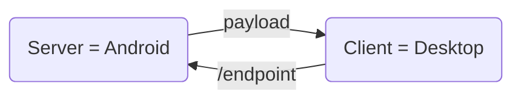

## Test połączenia w sieci lokalnej znając IP odbiorcy (android)

<div style="text-align: center;">


</div>


!!! note annotate "Wyjaśnienie:"

    Diagram przedstawia mini-serwer działający na telefonie z androidem w aplikacji Termux. Komunikacja pozwala na zdalne sterowanie funkcjami telefonu (wibracja, latarka, status baterii) poprzez zapytania HTTP przez python w frameworku Flask.


---
Przygotowanie pliku do testu:

### 1. Utworzenie pliku:

*Najszybciej zrobić to komendą nano (edytor tekstu):*

``` nano apy01.py```

### 2. Nadanie uprawnień (opcjonalnie, ale wygodne)

*Aby móc uruchamiać skrypt jak program*

``` chmod +x api01.py ```

### 3. Uruchomienie:

*Możliwe uruchonienie poprzez komende*
 ```python api01.py``` *lub* ```./api01.py```


### 4. Lokalizacja pliku

*Plik znajduje się w ```/data/data/com.termux/files/home/api.py``` W terminalu Termux. Domyślny folder (widoczny po wpisaniu ```ls```).*


### 5. Przygotowanie środowiska (Termux):

Przed uruchomieniem skryptu, należy zainstalować niezbędne narzędzia w Termuxie:


```
# Aktualizacja pakietów
pkg update && pkg upgrade

# Instalacja Pythona i API Termuxa
pkg install python termux-api

# Instalacja biblioteki Flask
pip install flask
```

#### 1. Kod programu:

```
#!/data/data/com.termux/files/usr/bin/env python3
from flask import Flask, request, jsonify, abort
import subprocess
import datetime

app = Flask(__name__)

# Zmień token na własny!
AUTH_TOKEN = "moja_tajna_token"

def check_auth():
    """Sprawdza nagłówek Authorization."""
    auth = request.headers.get("Authorization", "")
    if auth != f"Bearer {AUTH_TOKEN}":
        abort(401, description="Brak autoryzacji")

def run_cmd(args, timeout=10):
    """Bezpieczne wywoływanie komend systemowych Termux."""
    try:
        p = subprocess.run(args, capture_output=True, text=True, timeout=timeout)
        return p.returncode, p.stdout.strip(), p.stderr.strip()
    except Exception as e:
        return -1, "", str(e)

@app.before_request
def before_request():
    """Automatycznie sprawdza autoryzację dla każdego endpointu poza ewentualnym /health."""
    check_auth()

@app.route("/vibrate", methods=["POST"])
def vibrate():
    # termux-vibrate: -d to czas w ms
    code, out, err = run_cmd(["termux-vibrate", "-d", "300"])
    if code == 0:
        return jsonify({"status": "ok"}), 200
    return jsonify({"error": err or out}), 500

@app.route("/bat", methods=["GET"])
def battery():
    code, out, err = run_cmd(["termux-battery-status"])
    if code == 0 and out:
        # out jest już stringiem JSON z termux-api, przekazujemy go bezpośrednio
        from flask import Response
        return Response(out, mimetype='application/json')
    return jsonify({"error": err}), 500

@app.route("/torch", methods=["POST"])
def torch():
    # Pobieranie akcji z JSON lub parametrów URL (?action=on)
    data = request.get_json(silent=True) or {}
    action = data.get("action") or request.args.get("action")

    if action not in ("on", "off"):
        return jsonify({"error": "Użyj {'action':'on'} lub {'action':'off'}"}), 400

    code, out, err = run_cmd(["termux-torch", action])
    if code == 0:
        return jsonify({"status": f"torch {action}"}), 200
    return jsonify({"error": err or out}), 500

@app.route("/status", methods=["GET"])
def status():
    # datetime.datetime.now(datetime.timezone.utc) jest zalecane zamiast utcnow()
    info = {
        "time": datetime.datetime.now(datetime.timezone.utc).isoformat(),
        "uptime": run_cmd(["uptime", "-p"])[1] # -p daje ładniejszy format
    }
    return jsonify(info)

if __name__ == "__main__":
    # debug=False na produkcji, ale w Termux pomaga przy testach
    app.run(host="0.0.0.0", port=8080, debug=False)
```


#### 2. Opis funkcji w kodzie ```api01.py```


| Nazwa funkcji | Opis funkcji | 
| :------------------: | :-------------------------: | 
| check_auth():                             | Funkcja bezpieczeństwa. Sprawdza, czy w nagłówku zapytania znajduje się poprawny token (Bearer moja_tajna_token). Jeśli go nie ma - serwer odrzuca połączenie (401).    | 
| run_cmd(args):                            | Pomocnik, który "wpisuje" komendy do systemowego terminala Termux (np. termux-vibrate) i przechwytuje wynik. | 
| @app.route("/vibrate", methods=["POST"]) : | Endpoint wibracji. Wywołuje termux-vibrate -d 300. |
| @app.route("/bat", methods=["GET"]):      | Pobiera status baterii. Zwraca surowe dane JSON prosto z systemu Android.|
| @app.route("/torch", methods=["POST"]):   | Steruje latarką. Przyjmuje JSON {"action":"on"} lub {"action":"off"}. |
| @app.route("/status", methods=["GET"]):   | Zwraca aktualny czas serwera i "uptime" (jak długo telefon jest włączony). |

#### 3. Instrukcja testowania Komendy ```Curl``` (Client URL)
Poniżej znajdują się gotowe komendy do wywołania z innego urządzenia (laptopa) w tej samej sieci Wi-Fi.

**Założenie:** Adres IP telefonu to ```192.168.8.246```, a port w skrypcie to ```8080```.


|Instrukcja testu | Komenda |
| ----- | ---- |
|A. Sprawdzenie status serwera. Sprawdzejnie czasu i uptime telefonu. | ``` curl -H "Authorization: Bearer moja_tajna_token" http://192.168.8.246:8090/ ``` |
|B. Sprawdzenie stanu baterii. Zwraca procent naładowania, temperaturę i stan (ładowanie/rozładowywanie).| ``` curl -H "Authorization: Bearer moja_tajna_token" http://192.168.8.246:8080/bat ```|
| C. Wibracja (300ms). Wysyła sygnał wibracji do telefonu. | ``` curl -X POST -H "Authorization: Bearer moja_tajna_token" http://192.168.8.246:8080/vibrate ``` |
| D. Włączenie latarki. Wysyła instrukcję "on" w formacie JSON.|  ``` curl -X POST -H "Authorization: Bearer moja_tajna_token" -H "Content-Type: application/json" -d '{"action":"on"}' http://192.168.8.246:8080/torch ```|
| E. Wyłączenie latarki. Wysyła instrukcję "off" w formacie JSON. |``` curl -X POST -H "Authorization: Bearer moja_tajna_token" -H "Content-Type: application/json" -d '{"action":"off"}' http://192.168.8.246:8080/torch ```|


### 6. Rozwiązywanie problemów (FAQ)

| Błąd | Zachowanie | 
| :------------------: | :-------------------------: | 
| Błąd "405 Method Not Allowed": | Próbujesz otworzyć /vibrate lub /torch w przeglądarce. Te funkcje wymagają metody POST, której przeglądarka nie obsługuje przez samo wpisanie adresu. Użyj curl. |
| Błąd "401 Unauthorized": | Token w komendzie curl (po słowie Bearer) nie zgadza się z tym w skrypcie Python.|
|Błąd "Connection Refused": | Upewnij się, że skrypt na telefonie jest uruchomiony (python api01.py). Sprawdź, czy laptop i telefon są w tym samym Wi-Fi. prawdź, czy adres IP telefonu się nie zmienił (wpisz ifconfig w Termux| 


---
### Bonus:

Jeżeli porgram nadal działa zabij go komendą  ``` pkill -9 python ```

