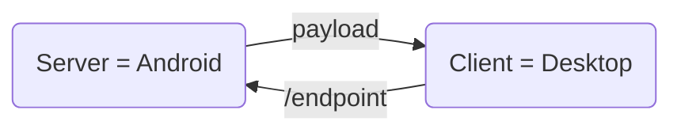

<div style="text-align: center;">


</div>


!!! note annotate "Serwer Aparatu: Robienie i odbieranie zdjęć przez API"

    Ten system pozwoli Ci wysłać zapytanie do telefonu, który zrobi zdjęcie i natychmiast prześle je w odpowiedzi do Twojego laptopa. Jest to rozwiązanie typu klient-serwer, gdzie Twój telefon pełni rolę aktywnego dostawcy usług.


### Krok 1: Przygotowanie (Wymagania)

*Upewnij się, że w Termuxie masz wszystko, co potrzebne (jeśli robiłeś poprzednie kroki, większość już masz):*

```
pkg install python termux-api
pip install flask
termux-setup-storage
```

### Krok 2: Tworzenie pliku skryptu

1. Wpisz komendę: ```nano remote_camera.py```

2. Wklej poniższy kod (zwróć uwagę na ```AUTH_TOKEN```):

```
#!/usr/bin/env python3
from flask import Flask, request, send_file, abort, jsonify
import subprocess
import os
import datetime

app = Flask(__name__)

# --- KONFIGURACJA ---
AUTH_TOKEN = "moje_foto_2024"  # Twój token do curl
# Ścieżka do zapisu tymczasowego zdjęcia
PHOTO_PATH = os.path.expanduser("~/storage/pictures/TermuxPhotos/remote_snap.jpg")
os.makedirs(os.path.dirname(PHOTO_PATH), exist_ok=True)

def check_auth():
    auth = request.headers.get("Authorization", "")
    if auth != f"Bearer {AUTH_TOKEN}":
        abort(401)

@app.route("/capture", methods=["GET"])
def capture():
    """Robi zdjęcie i wysyła je w odpowiedzi."""
    check_auth()
    
    # 1. Wywołanie aparatu (-c 0 to tylny aparat)
    print("Robię zdjęcie...")
    res = subprocess.run(["termux-camera-photo", "-c", "0", PHOTO_PATH], capture_output=True)
    
    if res.returncode != 0:
        return jsonify({"error": "Aparat nie odpowiedział", "details": res.stderr.decode()}), 500
    
    # 2. Wysyłanie pliku do urządzenia, które o nie poprosiło
    if os.path.exists(PHOTO_PATH):
        return send_file(PHOTO_PATH, mimetype='image/jpeg')
    
    return jsonify({"error": "Plik nie został utworzony"}), 500

@app.route("/status", methods=["GET"])
def status():
    check_auth()
    return jsonify({"status": "online", "device": "Termux Camera Server"})

if __name__ == "__main__":
    # Uruchomienie serwera na porcie 8080
    app.run(host="0.0.0.0", port=8080)
```
- Zapisz: ```CTRL+O```, Enter. Wyjdź: ```CTRL+X```.

### Krok 3: Nadawanie uprawnień (chmod)

*Aby skrypt był traktowany przez system jako program wykonalny, nadaj mu uprawnienia:*

``` chmod +x remote_camera.py  ```


!!! note annotate "Ważne"
     *Flaga ```+x``` (executable) pozwala na bezpośrednie wywołanie pliku bez konieczności wpisywania słowa ```python``` przed nazwą.*

### Krok 4: Uruchomienie serwera

*Wpisz w Termux:*

``` ./remote_camera.py ```

Powinieneś zobaczyć napis: * Running on ```http://0.0.0```. To znaczy, że telefon czeka na polecenia.

### Krok 5: Jak zdalnie zrobić i pobrać zdjęcie? (Testowanie)

*Teraz usiądź przy laptopie (musi być w tym samym Wi-Fi co telefon). Otwórz terminal (CMD w Windows lub Terminal w Mac/Linux) i użyj poniższej komendy:*

### komenda do zrobienia zdjęcia i zapisania go na laptopie:

``` curl -H "Authorization: Bearer moje_foto_2024" http://192.168.8.246:8080/capture --output zdjecie_z_telefonu.jpg ```

**Gdzie zapisze się to zdjęcie?**

Zdjęcie zapisze się dokładnie w tym folderze, w którym aktualnie znajduje się Twój terminal na laptopie. Jeśli chcesz je zapisać np. na Pulpicie Windows, użyj pełnej ścieżki:
```--output C:\Users\TwojaNazwa\Desktop\foto_zdalne.jpg```


6. Rozwiązywanie problemów (FAQ)


|Błąd	| Zachowanie / Rozwiązanie |
| ------|--------|
|Błąd 401|	Niepoprawny AUTH_TOKEN. Sprawdź, czy w komendzie curl wpisałeś dokładnie to samo, co w skrypcie.|
|Connection Refused |	Upewnij się, że telefon i laptop są w tym samym Wi-Fi oraz czy adres IP telefonu (192.168.x.x) jest poprawny.|
|Zatrzymanie	| Naciśnij CTRL + C w Termuxie, aby wyłączyć serwer.|


### Co się wydarzy po wpisaniu tej komendy?

- Laptop wyśle prośbę do telefonu.
- Telefon "pstryknie" zdjęcie (możesz usłyszeć dźwięk migawki).
- Telefon prześle dane obrazu przez sieć.
- Na Twoim laptopie pojawi się nowy plik zdjecie_z_telefonu.jpg.

### Pro-Tip: Co jeśli chcesz tylko status?

```
curl -H "Authorization: Bearer moje_foto_2024" http://192.168.8.246:8080/status
```

### Podsumowanie dla początkującego:

- Plik: remote_camera.py
- Uruchamianie: ./remote_camera.py (po uprzednim chmod +x)
- Zatrzymywanie: CTRL+C w Termux.
- Lokalizacja zdjęcia: Zdjęcie zapisuje się też na telefonie w folderze Pictures/TermuxPhotos pod nazwą remote_snap.jpg (każde nowe nadpisuje poprzednie, by nie zapchać pamięci).


gdzie zapisze sie zrobione zdjecie na moim laptopie
Zdjęcie zapisze się dokładnie w tym folderze, w którym aktualnie znajduje się Twój terminal (wiersz poleceń) na laptopie.

W komendzie curl, której użyliśmy:
```
--output zdjecie_z_telefonu.jpg
```

Parametr --output (lub w skrócie -o) mówi programowi: „pobierz dane i stwórz z nich plik o tej nazwie w bieżącej lokalizacji”.

### Jeśli chcesz zapisać zdjęcie w konkretnym miejscu:
Możesz podać pełną ścieżkę w komendzie curl. Na przykład, aby zapisać je na Pulpicie w systemie Windows, wpisz:

```
curl -H "Authorization: Bearer moje_foto_2024" http://192.168.8.246:8080/capture --output C:\Users\TWOJA_NAZWA\Desktop\foto_zdalne.jpg
```

(Pamiętaj, aby zamienić TWOJA_NAZWA na Twoją nazwę użytkownika w Windows).
Wskazówka: Jeśli po prostu otworzyłeś terminal i nic nie zmieniałeś, zazwyczaj Twoją lokalizacją startową jest Twój folder użytkownika (np. C:\Users\NazwaUzytkownika).

