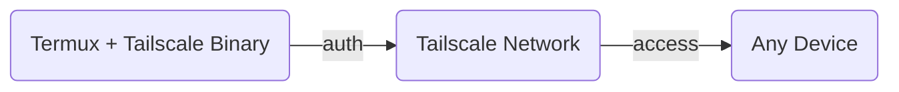

!!! note annotate "Konfiguracja: Tailscale w CLI Termux"
    Zamiast polegać na zewnętrznej aplikacji Androida, zainstalujemy Tailscale bezpośrednio w środowisku Termux. Pozwala to na zarządzanie siecią w całości z poziomu terminala i zapewnia lepszą wydajność dla serwerów Flask/Python.


### Krok 1: Instalacja pakietów

Otwórz Termux i zainstaluj niezbędne narzędzia:


```
# 1. Zaktualizuj repozytoria
pkg update && pkg upgrade

# 2. Zainstaluj Tailscale
pkg install tailscale
```

### Krok 2: Uruchomienie demona (Usługi)

Tailscale w CLI składa się z dwóch części: serwera (demona) oraz klienta. Najpierw musimy uruchomić serwer:

```tailscaled --tun=userspace-networking &```

!!! note annotate "Dlaczego tak?"
    Parametr ```--tun=userspace-networking``` jest niezbędny w Termuxie, ponieważ standardowy Android nie pozwala aplikacjom na bezpośredni dostęp do interfejsów sieciowych bez roota. Znak ```&``` sprawia, że usługa działa w tle.


### Krok 3: Logowanie do sieci

Teraz musisz połączyć Termuxa ze swoim kontem Tailscale: ```tailscale up```


**Co się wydarzy?**

- W terminalu pojawi się specjalny link.
- Skopiuj go i otwórz w przeglądarce na telefonie lub laptopie.
- Zaloguj się na swoje konto. Po poprawnym zalogowaniu Termux wyświetli komunikat: Success.


### Krok 4: Sprawdzanie statusu i adresu IP

Aby upewnić się, że wszystko działa i poznać swój adres IP, wpisz:

```tailscale status```

W kolumnie obok nazwy urządzenia zobaczysz adres IP (zaczynający się od ```100.x.y.z```). To właśnie tego adresu używaj w komendach ```curl```.


### 5. Wyjaśnienie kluczowych poleceń

|Polecenia: | Wyjaśnienie|
|-------|-------|
|```tailscale ip```: |Szybki sposób na podejrzenie tylko Twojego adresu IP w sieci.|
|```tailscale down```:| Rozłącza Cię z bezpieczną siecią (ale nie wyłącza usługi).|
|```tailscale up --force-reauth```:| Przydatne, jeśli chcesz zmienić konto lub zresetować połączenie.|


### 6. Rozwiązywanie problemów (FAQ)


| Błąd | Rozwiązanie|
| ----- | ----- |
|"failed to connect to local tailscaled" | Oznacza, że zapomniałeś uruchomić komendę z Kroku 2 (```tailscaled```).|
|Brak internetu? | Upewnij się, że nie masz włączonego innego VPN-a w tym samym czasie. |
| Jak wyłączyć całkowicie? | Wpisz ```pkill``` tailscaled, aby zabić proces działający w tle.|

**Wskazówka:** Jeśli chcesz, aby Tailscale startował automatycznie przy każdym otwarciu Termuxa, możesz dodać komendy z Kroku 2 i 3 do pliku ```~/.bashrc.```
