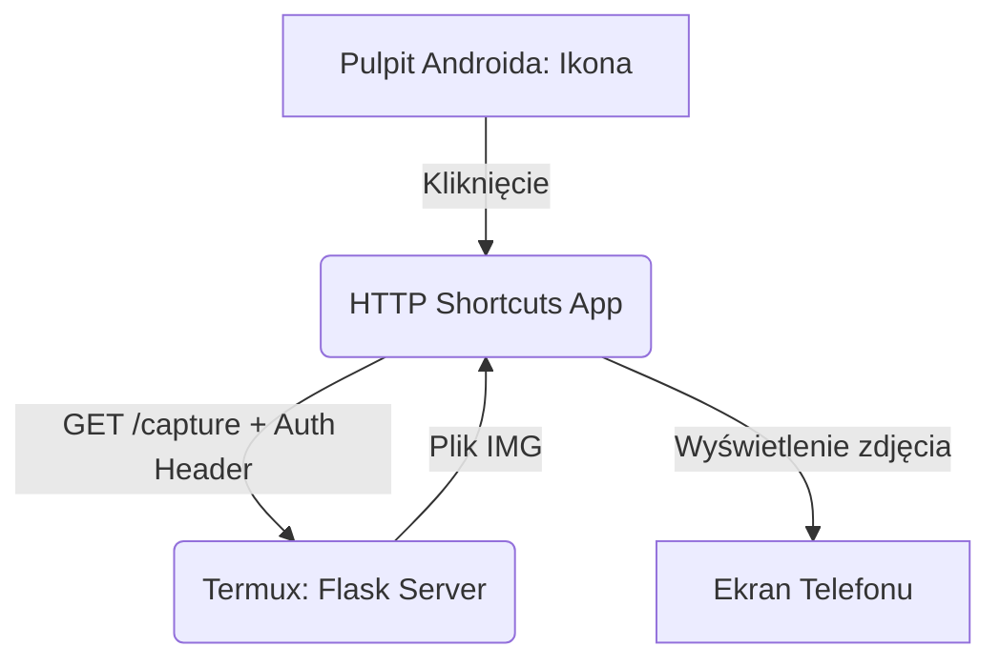

!!! abstract "Cel: Utworzenie przysków do zapytań w aplikacji HTTP Shortcuts:"
    Aplikacja ta pozwala zamienić surowe zapytania API w eleganckie przyciski. Dzięki temu możesz wyzwalać aparat w Termuxie jednym kliknięciem, bez otwierania terminala.


### Krok 1: Instalacja i konfiguracja

- Pobierz HTTP Shortcuts ze sklepu F-Droid lub Google Play.
- Otwórz aplikację i kliknij ikonę + (plus), aby stworzyć nowy skrót.
- Wybierz typ: HTTP Shortcut.

- Wypełnij pola zgodnie z Twoim skryptem ```remote_camera.py```:
- Method: ```GET```
- URL: ```http://localhost:8080/capture ``` (używamy localhost, bo aplikacja jest na tym samym urządzeniu co Termux).
- Kliknij "Add Header" i wpisz:
  - - Key: ```Authorization```
  - - Value: ```Bearer moje_foto_2024```

### Krok 2: Obsługa odpowiedzi (Wyświetlanie zdjęcia) oraz wygląd widget'u

Aby po kliknięciu przycisku zdjęcie od razu pojawiło się na ekranie:

- Przejdź do sekcji Response Handling (Obsługa odpowiedzi).
- Response Display: Ustaw na Window (lub "Show as Image").
- Response Type: Wybierz Image.

- W sekcji General nadaj skrótowi nazwę (np. "Zrób Zdjęcie") i wybierz ikonę aparatu.
- Zapisz skrót (ikona dyskietki/ptaszka).
- Wyjdź do pulpitu telefonu, przytrzymaj palec na ekranie i dodaj Widget HTTP Shortcuts, wybierając stworzony przed chwilą przycisk.


!!! note annotate "Zalety tego rozwiązania:"
    - Brak terminala: Nie musisz nic pisać. Działa jak zwykła aplikacja aparatu.
    - Działa z Tailscale: Jeśli jesteś poza domem, w polu URL wpisz swój adres IP z Tailscale (np. ```http://100.x.y.z:8080/capture)```, a przycisk będzie robił zdjęcia zdalnie z dowolnego miejsca.
    - Zmienne: Możesz stworzyć drugi przycisk do sprawdzania statusu (```/status)```, który wyświetli komunikat "Online".


### 3. Rozwiązywanie potencjalnych problemów (FAQ)

|Problem |	Rozwiązanie|
| ----- | ----- |
|Connection Refused | Upewnij się, że skrypt ```remote_camera.py``` jest uruchomiony w Termuxie.|
|Error 401 | Sprawdź, czy w nagłówku Authorization nie ma literówki (musi być słowo ```Bearer``` przed tokenem).|
|Zdjęcie się nie odświeża | W ustawieniach odpowiedzi upewnij się, że nie masz włączonego agresywnego cache'owania. |

